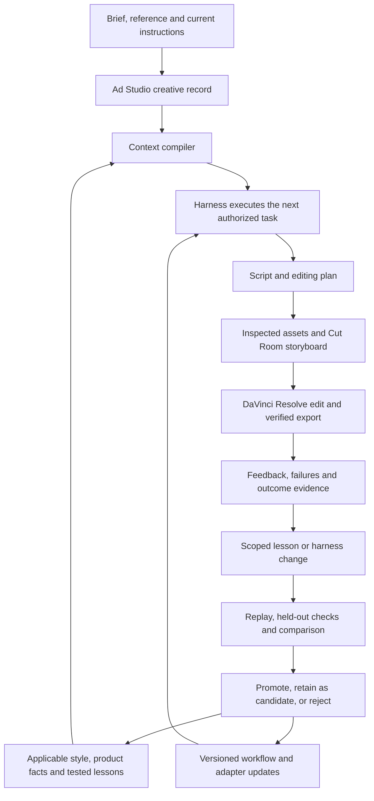

# Ad harness: recursive learning and concept-specific editing

September 13 scope update: [Ecommerce creative harness: GPT-6 overseer and specialist agents](ECOMMERCE-AGENT-HARNESS-PLAN.md) is now the primary product/build plan. It supersedes this document's initial local-runtime, storage-cutover and build-order recommendations with a reusable tenant-scoped product and GPT-6-managed specialist workflow. The learning, evidence, style and rollback specifications below remain supporting detail where consistent with that plan.

Build the existing ad engine into a persistent production system that improves through actual work. Every concept should leave behind a reproducible account of what was attempted, what Brooks corrected, what worked, what failed, and which changes deserve reuse. Later runs should retrieve those lessons, apply them in the appropriate style, and provide evidence that they helped.

The system should learn scripting, visual storytelling, generation, editing, verification and execution reliability. Editing is the first proving ground because the workspace already contains concrete corrections and completed Resolve revisions.

This is a build plan. It does not enable a worker, change production policies, generate ad assets or modify an editor project. The September 13 request establishes the intended direction; current workspace instructions remain authoritative. This document is a proposed successor to [[_engine/product/HARNESS-PLAN|the September 3 harness plan]].

**1. What we have and what needs to change**

Inspection on September 13, 2026 covered the harness implementation, ad-system implementation and databases, Obsidian memory, specialist skills, Cut Room builder, and selected Eleanor production receipts. Historical media-review statements below are attributed to those receipts; this planning pass did not repeat their media audits.

| Component | Observed foundation | Required extension |
|---|---|---|
| `_engine/harness` | Agent SDK runner, workflow specs, tool hooks, run queue, traces, reports and simple evaluations. Three historical runs: one done, one cancelled, one blocked on human. | Connect execution to the current creative/task record; add resumable attempts, structured feedback, version pins and evaluated learning. |
| `_engine/ad-system` | Fifteen revisioned creative records, 98 events, four tasks, four decisions and ten registered exports. Exact narration locks, scene reasons, review staleness and export/ad bindings already exist. | Make this the durable authority for production state and learning records. Connect its work packets to real execution. |
| Obsidian memory | Generated creative notes and separate editable agent notes. Latest inspected sync: September 13, 17:07:36 UTC, event 98, no reported errors. | Retrieve applicable lessons by task, style and evidence; retain provenance and preserve editable notes. |
| Existing harness memory | `context.py` inserts up to five recent reports for the same brand/product, including blocked runs. | Select relevant, supported lessons and examples. Report recency or a completed run must not imply that an approach was good. |
| Existing evaluations | Law checks on selected tool artifacts, report existence, stop condition and model cost. | Evaluate actual storyboard media, narration, timeline state, exports, style and recurrence of known mistakes. |
| Cut Room | Existing board builder, brand projects and cloud asset storage. | Bind feedback and selected assets to exact board/card revisions and stable beat IDs. |
| Resolve | Actual concept-specific editing scripts and delivery receipts exist. Preferred MCP exposes app/editor tools. | Build and verify a reusable adapter with project isolation, state readback, recovery and export checks. |
| Performance | Structured store currently contains zero measurement rows and zero exact platform ad bindings. Notes contain separate campaign audits. | Reconcile exact exports/ad IDs before using results to learn which creative choices perform. |

Several historical defaults need reconciliation before automation:

- The old `reference-adapt` workflow forbids generated storyboard images, stops on a returned URL and asks for blanket board approval. Current instructions require populated Cut Room storyboards and continuation within existing authorization.
- Its blanket product-visible-throughout rule conflicts with concept-specific reveal instructions. Styles must carry applicable reveal rules rather than inherit one global reveal pattern.
- Legacy ad-engine documentation names older editor/provider routes. Its animation runner silently rounds and clamps durations. The new adapter must honor the requested provider/duration contract and report unsupported combinations.
- The current harness assigns run status before its evaluation pass, and its file-stop failure handling differs from its tool-stop handling. Delivery must depend on validated outcomes, including file stops, not only a successful tool response.
- The SDK budget is not a complete external-generation budget. Provider cost, retries and uncertainty need their own ledger checks.
- The current ad record validates one fixed production-route object. Explicit concept exceptions, such as the documented Eleanor HeyGen presenter request, need a typed, scoped exception record without relaxing the global Google Omni default.

Read-only Resolve check during this plan: `resolve_control.runtime_mode` reported one running GUI instance and `database_attached: false`; its operation envelope marked verification unverified. Treat project access as unresolved until independently checked. The tool's restart recommendation was not executed. Historical successful Lua editing does not establish current MCP readiness.

**2. Target structure and ownership**

Keep the existing local Python system and Agent SDK runner as the initial implementation. Put model/session execution behind a small interface so later runtime choices can be evaluated without replacing creative records or workflows. The agent reasons about the creative; ordinary code owns persistence, dependencies, capability checks, budgets, receipts and completion rules.



Ad Studio owns the task graph and current creative revision. The harness executes attempts of those tasks. Do not operate two independent production queues. A task can have several attempts, but only one active owner of a given mutable resource.

Extend `ad-system/data/system.sqlite3` with migration-managed run/learning tables. Import the three legacy runs with original IDs and source provenance; verify counts and receipts before making the old `harness.db` a historical read-only source. Keep the provider registry as the authority for provider job handles, actual assets and cost receipts, linked by stable IDs. Avoid a bulk media move.

Use transactionally written events and an outbox for external work. Reconcile provider handles and actual Resolve/Cut Room state after interruptions before retrying. Exactly-once external execution cannot be assumed: where a provider lacks idempotency support, an uncertain submission stays unresolved until its status is investigated.

Existing Ad Studio, Cut Room and Obsidian remain the user surfaces. Add run history and learning views to Ad Studio. Do not introduce another dashboard or require a messaging channel for normal work.

**3. The production loop**

Each run begins with a pinned creative revision, current authorization, instruction sources, selected product references, narration/voice hashes, style version, active lessons and required outputs.

1. Recover context and source evidence. For a reference concept, inspect actual frames/audio and record audit coverage, consecutive-frame cut boundaries and observation versus inference. For original direction, record that no reference was supplied.
2. Develop or preserve the script according to the assignment. Keep the buying argument, presentation format and opening distinct. Claims and product facts retain their own evidence requirements.
3. Save/update the editing plan before image, video or voice generation. Every beat includes the exact line, visual action, source/gap, cue, provisional duration, transitions, movement, captions, audio and both scene/edit rationales.
4. Produce or source the authorized first assets. GPT Image 2 handles images; Google Omni handles generated video, subject to explicit scoped user exceptions. Inspect identity, actual action, style and whole-ad variety.
5. Deliver the populated Cut Room board in the correct brand project with selected images on the matching cards, separate reference lane and accessible assets. A storyboard task completes with its working URL and required asset set.
6. Align the selected narration. Compile the plan into Resolve operations, retaining source time, target frame, word and beat mappings. Protect existing projects and timelines.
7. Inspect the actual export with sound and the relevant frame evidence. Reconcile automated flags against direct evidence, register immutable export bytes and record remaining limitations.
8. Capture feedback and outcomes. Repair only affected dependencies where possible. A new voice alignment invalidates dependent cuts and captions; a visual-only revision preserves approved speech and word timing.

Task scope controls the stopping point: a planning-only task delivers the plan; a storyboard task delivers its first assets and board; an authorized edit continues through verified export. A simple native hero follows its compact visual plan and provider-output path without an unnecessary timeline.

**4. What the system learns**

| Learning type | Example | Scope and evidence |
|---|---|---|
| User direction | “Make this presenter larger and fully in the corner.” | Apply immediately to the authorized concept revision. Save exact source/date and intended scope. Broader transfer is a separate proposal. |
| Scripting craft | An approved revision changes sentence structure or delays a reveal. | Preserve original/revised text and stated rationale. Reuse in matching arguments/formats; do not silently rewrite locked narration. |
| Visual storytelling | A selected insert illustrates the wrong action or repeats the same composition. | Store line, rejected/selected assets, actual inspection and reason. Add an applicable prevention check. |
| Editing style | Preserve listener reactions in one podcast family; use continuous corner guide coverage in another family. | Store conditional rules, positive examples, counterexamples and section-specific timing. |
| Execution reliability | A particular Resolve import introduces audio offset or misreads numbered stills as a sequence. | Pin app/adapter version, source media properties, reproduction and verified fix. Recheck after upgrades. |
| Review reliability | An automated judge incorrectly flags a keyed edge or caption collision. | Retain both the original flag and evidence that resolved it; calibrate the judge rather than adopting the flag as fact. |
| Campaign response | A matched export has a different retention curve or purchase outcome. | Exact ad/export binding, dates, definitions, attribution and competing explanations required. |

Initial learning changes the harness's memory, retrieval, style recipes, prompts, checks and executable adapters. Base-model weight training is a later option requiring a separate dataset and evaluation case.

**5. Concept-specific editing memory**

A brand can contain several incompatible editing languages. Use a style family plus concept-specific overrides, rather than one editing-style record per brand.

Retrieval first filters by authorized workspace/brand, task, product/version where applicable, presentation format, style family and lesson status. It then ranks by exact relevance, evidence quality and recency. Exact concept corrections load first. Applicable format knowledge can transfer across brands; a brand's product claims, identity assets and private preferences remain explicitly scoped. Record why each lesson was included or excluded.

Each versioned style profile contains:

- **Identity and scope:** family, version, parent family, applicable concepts, exclusions, reference hashes, audit coverage and approval provenance where it exists.
- **Story structure:** hook treatment, presenter roles, mechanism/proof coverage, reveal cue and CTA/end hold.
- **Separate event tracks:** base-picture cuts, overlays, captions, reframing/effects and audio. Caption changes do not inflate shot counts.
- **Conditional editing rules:** cue → action → intended viewer effect → exceptions. Distinguish camera motion inside a source from editor-applied motion.
- **Pacing by section:** recognition holds, explanations, demonstrations, reactions and rapid lists. Store observed ranges with evidence; final target timing follows approved words and action completion.
- **Visual treatment:** medium, character/product continuity, composition variety, palette, image finish and permitted medium changes.
- **Voice and mix:** selected speech/speed, pause intent, audio-picture offsets, music/SFX priorities and caption synchronization.
- **Executable recipes:** tested Resolve operations, normalized layout anchors, required media properties, known version limitations and readback checks.
- **Examples and outcomes:** accepted and rejected frame/clip pairs with source pointers, explanations, verified fixes, unresolved disagreements and evaluation history.

Keep style intent separate from numerical implementation. “Corner guide remains visible without covering the bag or captions” can transfer; `zoom=0.33` belongs to one canvas/presenter geometry until tested elsewhere. Normalize layout to canvas dimensions and subject bounds, then verify it on the actual frame.

Learning must preserve variety. Fashion aspiration, podcast reactions, animated worlds and scientific explanations receive their own conditions. A failure in one concept must not turn into a universal cutting rate, reaction style or B-roll formula.

**6. How feedback becomes a reusable lesson**

Capture corrections from conversation, Cut Room feedback and Resolve review markers through one feedback API. The first implementation can record feedback directly from the working agent; Cut Room/Resolve event ingestion follows after verifying their available APIs. Do not assume those feeds already exist.

The feedback record links the exact quote or detected issue to the creative revision, run, beat/card, source/target time interval, asset/export hashes and before/after artifacts. Record whether it is a user instruction, observation, hypothesis or automated flag. Missing history remains unknown.

The learner then:

1. Diagnoses the cause: missing context, wrong selection, wrong execution, capability failure, reviewer error or an actual creative preference.
2. Proposes the smallest useful change and its scope. “Read the existing pause map before re-editing” and “fix the audio importer” are different repairs.
3. Creates a reproduction case and a relevant counterexample before testing the change.
4. Compares the current version and candidate on the same inputs, first using cached artifacts and recorded tool responses when valid.
5. Runs separate held-out cases and cross-style regression checks.
6. Activates, retains as candidate or rejects the change with an evidence receipt. Future runs pin the active version; in-progress runs do not change underneath themselves.
7. Monitors subsequent eligible work for recurrence and reverts the version if it causes a regression.

Proposed lesson lifecycle: `captured → candidate → testing → active → superseded/rejected/rolled_back`. Store evidence type separately from lifecycle. A valid user instruction applies at once within its scope; it does not wait for experiments to become authoritative. A single successful fix can become a concept-local recipe, while broader promotion requires transfer evidence.

Retrieve a compact lesson summary plus relevant positive/negative examples, with links to originals. Avoid loading every prior report. Consolidation may merge duplicate lessons while preserving their original events, counterevidence and superseded relationships. External references and generated critiques are evidence inputs; they cannot rewrite user policy.

**7. A first learning case from our own work**

Use `VELA-72dfab2c0c6d`, Eleanor European travel, as the first pilot after source/revision reconciliation.

The September 12 memory records Brooks's request to remove dead spaces and enlarge/reposition the avatar. The saved Tight delivery receipt reports 27 internal quiet-gap cuts removing 8.833 seconds internally, a 70.667-second picture duration, presenter zoom changing from 0.28 to 0.33, preserved approved captions and verified audio timing. These are historical technical findings, not proof of improved hook rate or a blanket rule to remove every pause.

The candidate lesson is: for this guided fashion treatment, identify unnecessary dead spaces while preserving words, breaths needed for natural delivery, visual comprehension and final CTA readability; ripple presenter, speech and captions through one source-to-target map. Use corner placement that clears the selected bags and captions.

The technical recipe can reproduce the requested edit on an isolated copy and verify the synchronized result. A new guided-fashion script tests transfer. A podcast reaction and an animated action-completion beat serve as counterexamples: the learned cleanup must retain their intentional holds. The source receipt's 0.2-second silence check is an evaluation observation from that edit, not a universal pause threshold.

Other seed cases already present in the notes: MP3 import offset resolved by PCM WAV; numbered stills interpreted as image sequences; repeated/similar B-roll; old board images surviving a revision; and automated visual flags contradicted by native-frame inspection. Confirm originals and exact scope before making each a benchmark.

**8. Recursive improvement of the harness itself**

The production loop supplies incidents. A separate improvement job clusters recurring incidents and proposes changes to retrieval, workflow prompts, style recipes, adapter code or checks. Its output is an exact versioned patch, reproduction case, evaluation comparison and rollback target.

Start with one candidate change per learning cycle and at most two repair attempts per task as proposed configurable defaults. Each cycle has its own time, model and provider-cost allowance drawn from the authorized run budget. A learning job cannot allocate itself unlimited paid runs or recursively start another learning job. Stop when the required checks pass, the candidate shows no improvement, or the configured budget is exhausted; preserve partial evidence and the best verified state.

Reversible context and style-recipe updates can activate automatically once the agreed promotion checks pass. Workflow/adapter code changes run in an isolated code checkout and test environment, then enter a limited production trial within existing authorization. Keep the previous release available. User policy, credentials, allowed external actions and production-route authority sit outside the learner's writable surface.

The learner may propose better evaluation criteria, but a candidate cannot alter the checker or held-out examples used to judge itself. Evaluate checker changes as their own versioned change against retained human corrections. Current user instructions cannot be converted into merely optional preferences by an evaluation score.

This recursion is measurable: the system improves how it selects and executes edits, and also improves how it retrieves lessons, detects failures and tests proposed fixes.

**9. Evaluation and promotion contract**

Use three complementary review methods: deterministic checks for exact properties, media/model review for semantic/style judgments, and Brooks's actual corrections to calibrate those judgments. Separating capability improvement from regression protection follows [Anthropic's agent evaluation guidance](https://www.anthropic.com/engineering/demystifying-evals-for-ai-agents). The requirements below are proposed for this workspace.

| Layer | Required evidence |
|---|---|
| Instruction/record integrity | Correct current rules, exact locked narration, scoped exceptions, complete plan before generation, immutable export bindings and no fabricated approvals. |
| Asset/storyboard | Actual selected assets accessible on correct cards; required presenter/scenes/overlays/first frames; separate reference lane; product identity and visible-action fit inspected. |
| Timeline/export | Source/target map, synchronized captions/audio, expected dimensions/frame rate, media present, cut/transition behavior, actual readable output and accessible editable project. |
| Style/story | Per-section reference fit, intentional presenter holds, action completion, visual variety, scene/edit rationale and approved reveal timing. |
| Reliability/cost | Reproduced failure repaired, restart safe, no duplicate provider job/timeline items, expected checks performed, actual time/spend recorded. |
| Transfer | Candidate succeeds on new eligible input and leaves relevant other styles intact. |

An initial benchmark set should contain roughly 12–20 evidence-backed cases across guided fashion UGC, podcast and animated/mechanism work. This is a bootstrap target, not a statistical sufficiency claim. If a category lacks inspected media, mark that part incomplete rather than inventing labels. Split by concept/reference family; variants of the same ad cannot leak into both development and held-out groups. Keep at least one eligible transfer example and one incompatible-style counterexample for every proposed broad lesson.

For the first releases, promote only when all applicable hard checks pass, the original issue is repaired, target quality improves under the pinned comparison method, and no critical cross-style regression appears. Repeat ambiguous model judgments with concealed candidate labels and reversed presentation order. Retain disagreements as uncertainty. More runs of the same generated asset do not become independent evidence of creative effectiveness.

Track repeat-correction rate per eligible opportunity, first-review acceptance, actual rework minutes, successful verified deliveries per attempt, provider waste, and retrieval errors. Record denominators and missing data. Baseline these before setting improvement targets; do not infer editing effort from file timestamps.

Campaign metrics form a separate objective. Join raw measurements to exact exports and platform IDs, preserve metric definitions/reporting windows and account for audience, spend, offer and landing-page differences. Good technical quality is not proof of conversion improvement. Do not optimize hook rate alone when downstream conversion deteriorates.

**10. Resolve adapter and tool learning**

The preferred [DaVinci Resolve MCP](https://github.com/samuelgursky/davinci-resolve-mcp) documents execution traces, operation verification and timeline/render controls. Its documented capabilities are an integration starting point; every operation still needs a capability check against the actual connected build.

Build a domain adapter whose inputs are the approved plan and asset manifest. Proposed operations include inspecting capabilities, opening an isolated working timeline, applying an edit specification, reading back timeline state, producing a preview/export and collecting verification receipts. These are new adapter interfaces, not claims that identical MCP tool names exist.

Maintain a capability table keyed by Resolve version, edition, MCP revision and connection route. Verify database/project access as well as application presence. Test native APIs first; retain the existing in-app Lua route as a candidate fallback inside Resolve, subject to live verification. A connection problem must not silently route production to another editor.

Before mutation, record project/timeline identity and recoverable state. Serialize operations on a Resolve session. After mutation, compare expected and actual clip counts, ranges, layers, properties and captions. After render, inspect file contents and actual media. Persist the tool execution ID plus a stable local receipt; a tool's transient trace buffer is insufficient long-term memory.

Represent edits in a versioned neutral manifest with source media hash, source interval, target frame interval, selected word cues, layer, effect parameters, transition handles and expected checks. Use integer/rational clocks and explicit rounding; handle variable-rate source timestamps correctly. Rebuild only changed dependencies, and reconcile uncertain operations before retrying them.

**11. Data and file layout**

| Proposed record | Essential fields |
|---|---|
| Run attempt | task/creative/revision, parent attempt, owner/lease, instruction/context/style/code/model pins, tool capabilities, authorization scope, budget, receipts and outcome. |
| Feedback event | exact source/date, evidence type, before/after revision, beat/card/time mapping, artifact hashes, correction and resolution. |
| Lesson | scope, trigger, action, rationale, exclusions, provenance, counterevidence, version, lifecycle and evaluation links. |
| Style version | parent/family, conditional rules, event tracks, exemplars, verified recipes and concept overrides. |
| Evaluation case/result | fixed inputs, expected behavior, split, reviewer/checker version, candidate/baseline pins, observed outcome and costs. |
| Change/release | exact diff, source incidents, test results, activation scope, prior release, trial outcome and rollback receipt. |

Proposed implementation locations:

```text
_engine/harness/harness/
  context.py                 applicable context and pinned retrieval manifest
  runner.py                  execute ad-system task attempts
  learning/                  feedback, diagnosis, candidates and consolidation
  evaluations/               replay, held-out checks and media-review receipts
  adapters/                  Ad Studio, Cut Room, generation and Resolve
  releases/                  version activation and rollback
_engine/harness/benchmarks/   manifests and evidence pointers; no duplicate media dump
_engine/ad-system/            migrations, record API, work packets and learning UI
_engine/ad-system/data/memory/
  styles/                    generated readable style versions
  lessons/                   generated readable lesson summaries
  notes/                     existing editable notes, preserved
brands/<brand>/creative/<concept>/edit/
  editing-plan.md            continuing concept editorial authority
  reference-analysis/        inspected source evidence
  feedback/                  before/after artifacts and exact correction receipts
```

All new module paths are proposed. Keep source/artifact hashes and relative vault links. The workspace root currently is not a Git repository; put harness/adapter implementation changes in an isolated code repository or checkout with explicit releases. Keep heavy creative media in its existing storage. Database backups and rollback migrations must be validated before cutover.

Obsidian receives generated projections after committed changes. Editable notes stay separate. Remote mirrors carry revision/sync state and remain snapshots until verified current. No memory projection may silently change a structured approval, claim or performance finding.

**12. Build order with concrete completion gates**

| Phase | Work | Complete when |
|---|---|---|
| 1. Align the foundation | Reconcile legacy rules; add scoped exception/authorization records, schema migrations, version pins and one task/run owner. Establish baseline cases and Resolve capability check. | An existing creative produces a correct context packet; newer instructions override old defaults; stale writes and unsupported operations are correctly reported. |
| 2. Capture and retrieve lessons | Add feedback API, incident links, lesson states, conditional retrieval and Obsidian projections. Import selected historical cases with provenance. | A new session retrieves the relevant correction and its evidence, excludes an unrelated style rule, and preserves current narration/product selection. |
| 3. Prove one learned editing workflow | Build the guided-fashion style profile and verified Resolve adapter; replay the Eleanor correction on an isolated copy. | The original requested change is reproduced with synchronized captions/audio, actual timeline readback, inspected export and before/after receipt. |
| 4. Evaluate and promote | Add candidate/baseline comparisons, held-out transfer, cross-style regression cases, limited trials and rollback. | One reusable lesson improves a second eligible input, preserves podcast/animation counterexamples, and can be reverted without losing creative history. |
| 5. Close the autonomous production loop | Connect scripts/plans, generation receipts, populated Cut Room boards, alignment, Resolve edits and delivery into resumable tasks. | A new authorized concept reaches a verified deliverable; interruption/restart does not duplicate paid jobs or corrupt timelines; its feedback reaches the next run. |
| 6. Improve the harness and connect results | Allow evaluated prompt/retrieval/adapter changes; expand style families; reconcile real ad IDs and imports. | A recurring operational defect yields a tested release and rollback receipt. Performance learning stays evidence-limited until exact bindings exist. |

Do not wait for all six phases to gain value. Phases 1–3 should make the next relevant concept easier to execute and less dependent on repeated corrections. Phases 4–6 establish broader, measured self-improvement.

Proposed initial scope: one local worker, one Resolve session, three contrasting style families for evaluation, and one production pilot. Paid generations occur only where they are needed for the authorized work or an allocated experiment. Volume, concurrency and generation budgets should be chosen from baseline costs and the actual requested workload rather than invented calendar estimates.

The first implementation packet should deliver migrations, the feedback/lesson schema, context retrieval, six confirmed seed incidents and a documented baseline for the Eleanor replay. Its review artifact should show the original correction, retrieved lesson, expected next-run behavior and exact evidence. Broader autonomous production follows the completion gates above.

**13. How this should feel to use**

Brooks starts or resumes a concept and receives a short account of the chosen style and applicable prior lessons. The harness produces the authorized work, shows the actual storyboard/edit, and records corrections without requiring a separate lesson-writing session. On the next similar concept it explains, briefly, which earlier correction changed its plan.

Ad Studio should expose: what was learned, where it applies, its evidence, which runs used it, whether it reduced repeat mistakes, and how to revert it. Cut Room continues to show selected media and scene/edit reasons. Obsidian makes the same memory readable to the next agent.

Success is demonstrated when a correction is no longer repeatedly requested on eligible work, new concepts retain their distinct editing styles, and the system can show the evidence behind each adopted improvement.

**Local evidence used for this plan**

- [[AGENTS|Current workspace instructions]] and [[_engine/product/HARNESS-PLAN|Original harness plan]].
- [Harness runner](../harness/harness/runner.py), [context retrieval](../harness/harness/context.py), [evaluations](../harness/harness/evals.py), [legacy workflow](../harness/harness/workflows/reference_adapt/spec.md).
- [[_engine/ad-system/README|Ad-system operations]], [[_engine/ad-system/SCHEMA|record schema]], [store](../ad-system/store.py), [workflows](../ad-system/workflow.py), [legacy generation runner](../mcp/ad-engine/workflows/plan_runner.py).
- [[_engine/ad-system/data/memory/INDEX|Memory index]], [[_engine/ad-system/data/memory/notes/VELA-72dfab2c0c6d|Eleanor notes]], [[_engine/ad-system/data/memory/notes/podcast-DVHp-2FDHAJ|Podcast notes]].
- [Editing-style skill](../../.claude/skills/ad-editing-style/SKILL.md), [B-roll storytelling skill](../../.claude/skills/broll-storytelling/SKILL.md), [Resolve handoff](../../.claude/skills/ad-editing-style/references/resolve-handoff.md), [Cut Room builder](../../cutroom/board_builder.py).
- [Eleanor Tight delivery receipt](../../brands/velantra/creative/eleanor-european-travel-2026-09-11/production/tight/qa/delivery-verification.json) and [existing Lua runner](../../brands/velantra/creative/eleanor-european-travel-2026-09-11/production/resolve/run_lua.py).
