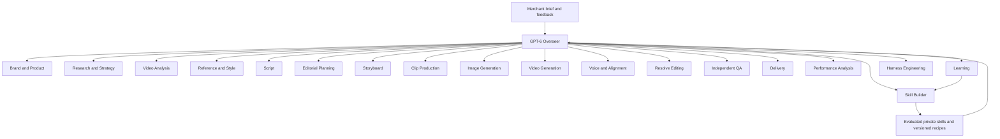

# Adaptive ecommerce harness: our production workflow, each merchant's context and skills

Turn the ad workflow already used in this workspace into an adaptive agentic harness for any brand. GPT-6 coordinates the same production stages and delegates to specialists, while each entrepreneur's existing project files, writing methods, brand knowledge, preferred concepts and editing styles configure how those specialists work. The harness imports existing skills, creates missing skills automatically and improves them through actual corrections and evaluated results. Our workspace is one customer configuration and a production-workflow reference, not the universal creative doctrine.

This plan incorporates the September 13 direction: serve any ecommerce entrepreneur, put GPT-6 in charge, and use agents beneath it for every production responsibility. It replaces the earlier local-only runtime recommendation and the September 2 product plan's customer-Claude/browser-editor architecture. The existing [self-improvement plan](AD-HARNESS-SELF-IMPROVEMENT-PLAN.md) remains the detailed foundation for feedback, style memory, evaluation and rollback wherever it agrees with this product architecture.

Everything marked proposed below is work to build. This planning turn does not deploy agents, alter customer infrastructure or authorize production spending.

**0. Governing correction: automate the workflow we already have**

User clarification, September 13, 2026: “it should be the exact workflow that we have, but turned into an agentic harness.” The subsequent clarification requires importing an entrepreneur's Claude/GPT project context, supporting their own writing methods, and automatically developing skills for their recurring concepts and editing styles. Preserve the production structure while making the creative methods tenant-specific. The agent roster assigns ownership of responsibilities; it does not create a mandatory stage for every role. Context/skill adaptation belongs in the first implementation; broad hosting, billing and onboarding UI remain later packaging work.

The production workflow comes from the ad-system task packets and the plan → assets/storyboard → production/alignment → Resolve → review/delivery process below. Each run compiles the applicable merchant instructions, imported or learned skills and selected concept records. Current workspace instructions govern our own tenant; other brands receive their own methods and context. Legacy instructions that conflict with newer explicit user direction remain superseded. Generic seed skills fill gaps and do not override an entrepreneur's selected writing method or concept treatment.

| Step in our existing workflow | Current implementation or skill | Agent ownership | Required behavior and artifact |
|---|---|---|---|
| W01. Recover the assignment and memory | Project-context import and tenant skill registry; locally `ad_system.py context CREATIVE_ID`; Obsidian index → brand → creative → editable notes | GPT-6 overseer, assisted by Brand and Product | Load this entrepreneur's current instructions, writing methods, product references and applicable skills. Resume actual selected revision, narration, plan, assets and outstanding handles; new concepts get a record |
| W02. Inspect the supplied reference or raw footage | Video-analysis tools; `ad-editing-style`; `broll-storytelling`; source evidence under `edit/reference-analysis/` | Video Analysis, with Reference and Style interpreting the findings | Inspect actual visual/audio evidence, consecutive-frame cut boundaries, narration-to-picture mapping, transitions, captions, motion, sound and pacing. If no reference exists, label original direction |
| W03. Develop or preserve the concept/script | Existing research/concept packets; entrepreneur's selected copy/script skill; `ai-ugc-vsl-scripting` as our tenant's applicable skill or a suitable fallback | Research and Strategy when needed; Script | Follow the entrepreneur's writing method, concept and audience needs; preserve exact selected narration. New research or rewriting happens only where the assignment needs it |
| W04. Create or update the editing plan | `_engine/sops/Ad-Editing-Plan-First-SOP.md`; `broll-storytelling`; `ad-editing-style`; concept-specific B-roll skill | Editorial Planning | Save `edit/editing-plan.md` before images, voice, video, assembly or export. Map every line to action/source/cue/timing/transitions/movement/captions/audio and both scene/edit reasons; timing provisional until alignment |
| W05. Source/generate and inspect the first asset set | Existing source/image packets; GPT Image 2; product skills; appropriate B-roll sourcing skill | Clip Production and Image Generation, with Video Analysis/QA where needed | Produce the presenter when used, each distinct covering scene, overlay and every planned video first frame. Inspect actual identity, meaning and variety; retain originals/provenance |
| W06. Deliver the storyboard in Cut Room | `.claude/skills/cutroom/SKILL.md`; `cutroom/board_builder.py` | Storyboard | Attach actual selected images to matching cards in the correct brand project; exact narration and editorial reasons; separate reference lane; verify board/media accessibility and return the working URL |
| W07. Produce/select narration and presenter media | Existing voice/presenter tools and recorded concept-specific instructions | Voice and Alignment | Preserve exact script, selected voice and authorized speed/settings. Record actual files, alignment and job handles. A presenter-provider exception applies only to its authorized scope |
| W08. Obtain the planned video/B-roll clips | Existing video/source packets; Google Omni for generated video; inspected first-frame references | Video Generation and Clip Production, supported by Video Analysis | Execute each planned action in its concept's treatment, inspect the selected interval, preserve native provider output and report unsupported duration/format rather than silently changing it |
| W09. Align the edit to selected narration | Existing word alignment and `edit/editing-plan.md` revision | Voice and Alignment; Editorial Planning | Map actual speech/action cues to cuts, transitions, captions and source ranges. Keep source and target timing explicit |
| W10. Edit in DaVinci Resolve | Current Resolve integration and native editing workflow; `ad-editing-style` Resolve handoff | Resolve Editing | Verify current connection/project access, isolate working timeline, implement the plan with actual selected assets, captions, motion, overlays and sound; preserve existing work |
| W11. Inspect and revise the actual result | Existing `review` packet; Video Analysis; actual frames/audio; independent QA | Video Analysis and Independent QA; GPT-6 routes fixes | Check the finished media and relevant consecutive cut frames; record evidence and fix affected beats. Update the plan before the revision. Visual-only changes preserve approved speech speed/alignment/captions |
| W12. Deliver and persist what happened | Current export/review receipts; Cut Room updates; ad-system structured saves and Obsidian memory refresh | Delivery; GPT-6 overseer; Learning | Deliver accessible export and editable Resolve project when editing is requested, record exact hashes/revision and current selected board assets, save observations/corrections with provenance |
| W13. Analyze actual campaign results when available | Existing exact export/ad bindings, measurement imports, decisions and iteration packets | Performance Analysis; Learning; GPT-6 | Use real compatible measurements and source IDs to propose the next test. This optional loop does not block ordinary delivery |

This is a dependency-preserving map, not a requirement to run every row on every request. A supplied approved script skips new script writing. Existing selected assets can satisfy production tasks. A storyboard-only assignment stops with its first assets and working Cut Room URL. An analysis-only task returns its findings. A simple native hero uses its compact plan and original provider output. After the plan exists, independent work may run concurrently within existing authorization; timing-dependent motion/presenter/edit work waits for the inputs it actually needs.

Preserve the existing concept routes: presenter VSL → `broll-heygen-vsl`; podcast → `broll-podcast`; skeleton → `broll-skeleton-ads`; animated → `broll-animated-ads`; narrated/faceless → `broll-ai-voiceover-vsl`. Use only relevant combinations for hybrids. TikTok extreme sourcing applies only when that sourcing assignment calls for it, including its exact-action, EV5 and no-text requirements. Fashion remains aspiration-led. Velantra continues to resolve exact product/color/size through its registry and product-specific skill. These existing creative decisions must survive the harness conversion.

**Workflow-parity acceptance:** given the same authorized brief, selected inputs and current instructions, the harness produces the same required kinds of artifacts, follows the same dependencies/tools and honors the same correction boundaries. Stochastic generated pixels need not match. A completed plan alone, a text-only board, a provider-success message or a fake final-review claim does not count as parity. No additional user checkpoint is introduced by an agent boundary.

New infrastructure begins with project/context intake, tenant skill compilation, GPT-6 delegation, task execution/resumption, verified receipts and tested learning around this workflow. Use the existing Ad Studio/CLI, Cut Room and Obsidian surfaces for our initial execution pilot, alongside isolated synthetic merchant packages that verify adaptation from the start. Capture detailed traces so differences in method, scope or output are visible and testable.

**1. Product scope and merchant experience**

The product gives solo merchants and small teams our established production workflow with agent coordination. Each merchant supplies brand/product knowledge, existing AI-project material, writing skills, examples, concept preferences and connections. The stages remain reusable; the creative methods inside them are selected and learned for that merchant.

A merchant should be able to say: “Create three vertical ads for this product in this style, using these references and this budget.” GPT-6 turns that into a concrete production brief and task graph, runs the specialists, resolves ordinary problems, and presents the required artifacts and meaningful decisions. The merchant can also request only a script, storyboard, clip, image, edit or revision. The requested endpoint determines which tasks execute.

The initial scope is the work our current ad system already performs: concepts, scripts, analysis, editing plans, static/product/creative images, clips, populated storyboards, complete edits, revisions and evidence-backed results analysis. “Any ecommerce entrepreneur” means making this same workflow portable with category-appropriate context.

Keep one user-facing conversation with the overseer. Specialists appear in an activity view with their task, output, elapsed time and cost, without requiring the merchant to coordinate separate chats.

**2. Onboarding any business**

Create an organization, workspace, members, brands and products. Use Shopify as the first live catalog integration; also accept product URLs, merchant-supplied documents, CSV and media so using another storefront platform does not block onboarding. Additional storefront connectors implement the same catalog contract.

The Brand and Product Agent produces a versioned brand/product dossier containing audience, voice, positioning, offers, variants, selected identity references, known dimensions, substantiated claims, prohibited claims, source provenance and uncertainties. Imported descriptions are merchant assertions until their relevant support is established. A generated image does not prove physical dimensions.

Collect preferences once where needed: deliverable formats, language, locale, currency, style references, generation connections, voice/presenter choices, Resolve execution route, spending allowance and desired review checkpoints. Existing instructions persist; do not ask again at every handoff.

Separate the configuration into:

| Layer | Examples | Change authority |
|---|---|---|
| Product-wide execution rules | Tenant isolation, output integrity, supported tool contracts, budget accounting | Versioned platform implementation |
| Workspace policy | Authorized actions, budgets, collaborators, review preferences, connected accounts | Merchant or authorized administrator |
| Brand/category direction | Voice, fashion aspiration, visual treatment, identity and reference preferences | Merchant instructions and scoped brand records |
| Product facts | Variant identity, materials, evidence-backed dimensions, offer and current source references | Versioned product evidence and authorized corrections |
| Concept direction | Selected script, reveal timing, style version, approved assets and requested changes | Current concept instructions and revisioned selections |
| Learned preferences | Conditional editing recipe, recurring correction, source-selection lesson | Tested lesson lifecycle within the allowed scope |

For our workspace, retain GPT Image 2, Google Omni, Cut Room and DaVinci Resolve routing, current plan-first rules, approved product references and the HyperFrames/Remotion ban. They form the initial supported production route. Explicit provider exceptions remain scoped records. Generalizing the product does not silently change our current workflow.

Obsidian is our workspace's memory interface. Other merchants can use built-in memory and optionally connect/export a Markdown vault. No account requires our vault, our folder structure or Obsidian installation.

**2a. Bring an existing Claude/GPT project into the harness**

Project intake is a core capability. An entrepreneur should be able to bring their existing material and begin sending concepts without rebuilding their brand knowledge or abandoning a successful writing method. Support a neutral project bundle first, plus read-only connectors where the source account exposes an authorized route.

| Source | Intended intake | What must be explicit |
|---|---|---|
| Local Claude Code/Codex/other agent folder | Scoped directory or archive containing instruction files, skills, documents, selected chats and media | Inventory only the selected project; retain original files and relative references; identify scripts/tool dependencies before use |
| Claude Project | Supplied project instructions, knowledge files and selected conversation/export data; eligible enterprise connector as an additional route | Ordinary exports need inspection for what they actually contain; do not assume all project files/instructions are present |
| ChatGPT Project | Supplied instructions, project source files and selected conversations/export material; verified account-specific connector if available | Distinguish a cloud ChatGPT project from a local agent folder and from a custom GPT; project access is not implied by an ordinary model API key |
| Custom GPT or prompt library | Owner-supplied instructions, knowledge documents, examples and action/tool descriptions | Preserve the writing method; tool descriptions are not working credentials or authorized integrations |
| Brand folder, Drive export or other files | Selected documents, PDFs, scripts, recordings, prior ads, feedback and product references | Record missing/unreadable items, source versions and permissions; preserve links to original evidence |

Current documentation supports this distinction: ChatGPT Projects have their own chats, files and instructions, while local agent projects use folders; the CLI does not expose the ChatGPT Projects view. [Official project documentation](https://learn.chatgpt.com/docs/projects)

OpenAI documents importing supported local setup, skills and recent work from other agents into its desktop/CLI products. That is useful compatibility evidence, not a claim that our harness already has that importer or can access every cloud project. [Official import documentation](https://learn.chatgpt.com/docs/import)

Claude documents individual conversation/account exports, and a separate Enterprise Compliance API can retrieve project details and attachments with the appropriate access. An enterprise connector is conditional on eligibility and authorization; a file-based intake path remains necessary for other users. [Claude exports](https://support.claude.com/en/articles/9450526-export-your-claude-data), [Claude project retrieval](https://platform.claude.com/docs/en/manage-claude/compliance-content-data)

The import pipeline preserves originals and builds an inventory with source IDs, hashes, original timestamps/roles where available, project membership, access scope and sync mode. Extract text, tables, images and relevant audio/video evidence with their own locators. Do not claim a PDF layout or a video was inspected solely because text extraction succeeded.

Classify the imported material into merchant instructions, writing/editing procedures, brand facts, product evidence, selected examples, rejected examples, historical feedback, hypotheses and source media. An entrepreneur-designated instruction file is actionable within its project scope. A quoted instruction inside a competitor script or generated chat response remains source content. Imported code/plugins are inspected for compatibility and required permissions before execution; arbitrary archive contents never become automatically executable.

Produce a concise **context map** showing what was imported, the identified brands/products, selected writing skills, current concept families, conflicting guidance, missing files and sync freshness. Preserve exact authored instructions and source-role information. Resolve conflicts through current explicit direction, scope and original evidence; do not treat newest file modification time as approval. Ask only about conflicts that materially block the requested task and continue independent work.

Source changes create new versions. Reimport deduplicates identical content; updates or removals invalidate dependent summaries, skills and context snapshots as appropriate. A one-time upload is labeled a snapshot. Synchronization is claimed only after actual source reads and checkpoints. The merchant can export its original project material, compiled skills, learned additions and provenance; changes to the upstream Claude/GPT project are a separately authorized write operation.

**2b. Compile the right creative method for each concept**

Select skills by workspace, brand/product, task, buying argument, presentation format, reference/style family, language, target length, audience sophistication and actual instructions. Category and format are separate dimensions: a supplement brand can run both a long educational VSL and a stylized animated ad, each with different script/editing needs.

Imported copywriting procedures can cover research inputs, hook structure, sentence rhythm, proof order, objections, mechanism explanations, dialogue, reveal timing, CTAs and output length. Retain these as reusable procedures with examples, not merely prose in a brand summary. The Script Agent receives the selected procedure and source examples; the Editorial Planning and Video Analysis agents receive the appropriate treatment/style skills. A new concept inherits only compatible skills and overrides.

Priority for creative preferences is the current task instruction, applicable merchant-authored/selected method, relevant validated private skill, then a suitable seed skill. Product claims still require evidence, and production authorization remains independently enforced. Where no method is supplied, the harness uses applicable defaults, labels inferred preferences and improves from feedback without requiring a merchant to author skills manually.

| Example merchant/concept | What the harness loads or builds | What successful adaptation demonstrates |
|---|---|---|
| Supplement brand with in-depth VSLs | Its research/claim evidence, long-form script method, mechanism/proof structure, desired sentence rhythm and explanatory edit style | New scripts follow that method; visual explanations receive sufficient time; approved claims and words remain intact |
| Merchant focused on Pixar-style 3D animated ads | Its character/world references, dialogue or narration conventions, emotional/action beats, continuity rules and animation-specific coverage/edit recipes | New scenes and scripts fit the selected animated world and complete the intended actions; live-action VSL coverage is not imposed |
| Same brand running both formats | Separate format skills under shared verified product facts and appropriate voice rules | The overseer routes each new concept correctly without allowing one style's learned pacing to overwrite the other |
| Merchant repeatedly iterating one concept family | Its selected reference profile, recurring script choices, rejected/accepted outputs and validated edit recipes | Fewer repeat corrections on new variants, evidenced by matched task/review history; no guaranteed conversion claim |

**3. The hierarchy**



This is one overseer role per isolated workspace, with separate persisted run state for each initiative. It is not one conversation containing every customer's data. The specialist names describe capability roles; workers instantiate only the roles needed for the current task. Multiple image or clip specialists can work on independent beats.

Use OpenAI's manager pattern: GPT-6 retains ownership of the user interaction and invokes specialists as bounded capabilities. The official [orchestration guide](https://developers.openai.com/api/docs/guides/agents/orchestration) documents this distinction between a manager using specialist tools and transferring the conversation to a specialist. Long production jobs additionally need our durable queue and event handling.

**4. What GPT-6 owns**

The overseer is the creative operations lead. It:

1. Interprets the request and retrieves current business, concept and learning context.
2. Chooses the necessary workflow and its completion criteria.
3. Assigns each task to a qualified specialist with exact inputs, scope and expected artifacts.
4. Sets dependencies, priorities, cost reservations and concurrency within the merchant's authorization.
5. Reviews specialist conclusions and independent QA, resolving conflicts against source evidence.
6. Sends targeted revisions to the responsible specialist, preserving unaffected work.
7. Replans around real asset/provider/editor failures while preserving the requested creative treatment.
8. Communicates material progress and batches genuinely missing merchant decisions.
9. Selects the verified deliverables and explains their status and relevant limitations.
10. Opens learning tasks and considers evaluated improvements for future work.

Its tool surface should expose proposed operations such as `get_context`, `create_task`, `inspect_task`, `request_revision`, `record_decision`, `select_artifact`, `check_budget` and `finish_run`. These are application contracts to implement, not existing tool claims.

The overseer does not receive unrestricted provider credentials or direct database mutation authority. Tools enforce tenancy, revisions, permissions and cost reservations. It cannot declare an incomplete artifact verified, approve itself as the merchant, or change a locked script outside an authorized revision.

GPT-6 should spend reasoning effort on planning, tradeoffs, diagnosis and evaluation. Polling provider jobs, copying assets, checking hashes, calculating totals and updating ordinary statuses run in code. A timer does not need another model call.

**5. Specialist contracts**

Every task below is owned by a specialist agent; mechanical helpers execute inside its bounded tool access. All agents report to GPT-6. A specialist requests another task through the overseer/scheduler rather than creating an unbounded agent tree.

| Agent role | Inputs | Responsibility and returned artifacts | Scope boundary |
|---|---|---|---|
| Brand and Product | Existing AI-project files/instructions, catalog, merchant skills/examples, selected references and current brand rules | Source inventory/context map, product/variant dossier, identity manifest, imported method bindings, claim-evidence map and unresolved facts | Reads authorized project/catalog sources; preserves source roles and provenance; cannot change upstream projects/store listings or invent support |
| Research and Strategy | Product dossier, audience, market/reference evidence, objective | Buying situations, objections, angle candidates, concept hypotheses and test variables | Source-backed research; no invented customers, testimonials or performance conclusions |
| Video Analysis | Actual reference ads, raw footage, generated clips, draft/final exports and analysis objective | Timestamped shot/event map, transcript/alignment evidence, motion/audio/text findings, usable intervals, cut-boundary frames and actionable diagnosis | Read-only access to source media; records inspection coverage and observed/inferred/unverified findings; cannot claim performance from appearance |
| Reference and Style | Video Analysis evidence, inspectable source media and target treatment | Reference style profile, conditional editing rules and retain/adapt/omit decisions | Explains how the observed editing language transfers; requests missing analysis and does not treat inferred purpose as observed fact |
| Script | Strategy, product evidence, merchant's selected writing skills/examples, reference flow and voice brief | Exact narration, hooks, script revision, claim links, word count and applied skill versions | Applies the relevant merchant method; preserves existing locks unless the requested revision authorizes a change |
| Editorial Planning | Selected script, style profile, source audit and asset inventory | Concrete editing plan, beat map, shot requirements, provisional timing, captions/audio direction and scene/edit reasons | Saves the plan before any production; owns the canonical editorial schedule |
| Storyboard | Plan, selected first assets and separate reference frames | Populated Cut Room board, card/beat bindings, asset revision manifest and verified URL | Sole writer of board structure; planning-only work can remain a plan, finished storyboard work requires media |
| Clip Production | Individual beat contract, visible action, treatment, duration and source constraints | Inspected usable shot or explicit gap, selected interval, provenance and reason it fits | Owns beat-level coverage; sources existing footage or requests image/video tasks; does not duplicate generation submissions |
| Image Generation | Image/first-frame brief, identity references, composition constraints | Actual GPT Image 2 outputs, prompts/reference IDs, generation receipts and inspected selection candidates | Can generate assigned assets; cannot change the product, style or script to make a job easier |
| Video Generation | Inspected first frame, motion brief, identity references, requested native format/duration | Actual Google Omni video, source originals, job/cost receipts and motion inspection | Reports unsupported duration/format; no silent trimming, retiming or provider substitution |
| Voice and Alignment | Exact narration, configured voice/presenter, delivery settings | Selected speech, word alignment, source hashes, pronunciation notes and authorized presenter-sync receipts | No silent narration edits or second speed change; calls configured audio/presenter tools within scope |
| Resolve Editing | Final alignment, selected shots, canonical edit plan, output spec | Isolated Resolve project/timeline revision, native effects/captions/mix, previews, export and operation readbacks | Sole writer for its leased Resolve session; preserves original projects and exact approved speech |
| Independent QA | Pinned artifact and evidence, style/identity requirements, frozen rubric | Pass/flag/fail findings with frame/time/line evidence, reproduction and targeted fixes | Read-only artifact access; separate reviewer session; cannot rewrite inputs or its grading standard |
| Delivery | QA-cleared export, editable project, board and asset manifest | Verified download/share links, immutable export binding, project package and delivery receipt | Publishing ads or contacting others requires explicit authorization beyond artifact delivery |
| Performance Analysis | Exact export/ad mappings, raw metrics, reporting settings, test hypothesis | Descriptive results, uncertainty, alternative explanations and next-test proposal | Account reads by default; no campaign changes or causal winner claims from weak evidence |
| Learning | Corrections, task traces, failures, fixes and later outcomes | Scoped lesson candidates, counterexamples, retrieval changes and evaluation requests | Cannot silently generalize private data, override user policy or promote itself |
| Skill Builder | Imported procedures, recurring concept/style needs, Learning diagnoses and actual source examples | Discoverable private skill packages, applicability/exclusion rules, examples, dependencies and candidate evaluation cases | Creates or updates scoped skill candidates automatically; preserves upstream originals, avoids duplicate skills and cannot grade/promote its own candidate |
| Harness Engineering | Diagnosed platform defect and bounded change request | Isolated code/prompt/adapter patch, reproduction, regression results and rollback package | No direct production deployment or access to unrelated merchant media/credentials |

Clip Production and Video Generation have distinct jobs. The former must obtain the right shot for a spoken beat, potentially from existing footage; the latter must execute a specific generated-video request. One scene task links them, and one generation job ID identifies the actual paid submission.

The Resolve Editing role can instantiate narrow caption, audio, layout or native Fusion subtasks when useful. Proposed edit fragments return to the canonical editor for integration, so several agents do not mutate the same timeline simultaneously.

Bind these role definitions to the current `research`, `concept`, `script`, `plan`, `source`, `images`, `video`, `storyboard`, `edit`, `review` and `analyze` work packets. Video Analysis is a specialist capability within reference planning, media review or a standalone authorized analysis task. The existing `analyze` packet refers to campaign performance; do not silently repurpose it. Additional helper roles share the existing stage/task owner and must not create competing script versions, schedules or approval gates.

**5a. Video Analysis as a dedicated capability**

The September 13 follow-up explicitly adds Video Analysis to the specialist team. It owns the inspection and diagnosis of actual video throughout the workflow and can also complete a standalone analysis request. Its responsibilities include:

- **Reference ads:** inspect the hook, narration-to-B-roll mapping, base-shot boundaries, transitions, zooms/reframing, overlays, captions, camera/subject motion, audio and section-specific pacing. Verify cut boundaries on consecutive source frames.
- **Raw footage:** identify usable takes and exact source intervals, visible actions, action completion, product visibility, embedded text, audio issues and continuity constraints. Supply handles where an edit needs them.
- **Generated clips:** inspect the entire selected interval for prompt/action fit, identity drift, motion defects, unwanted text, duration and usable entry/exit points. Return timestamped evidence for Clip Production and QA.
- **Draft and final edits:** diagnose gaps, premature cuts, repeated compositions, caption collisions/sync, speech continuity, sound balance and deviations from the pinned editing plan. Compare before/after revisions without assuming that a technical change improves conversion.
- **Learning examples:** extract reproducible evidence pairs and explain what visibly/audibly changed. Separate measured behavior from inferred editorial purpose; Performance Analysis owns campaign-result interpretation.

Its required output is a versioned analysis package: source asset IDs/hashes and media timebase; inspection scope and coverage; timestamped transcript/audio evidence where available; separate event tracks for base picture, overlays, captions, effects/framing and audio; evidence frames including consecutive cut-boundary pairs; usable source ranges; findings with severity and observed/inferred/unverified status; and proposed editorial implications with uncertainty. Variable-rate media uses source presentation timestamps. Sampling and an automated watch manifest must not be labeled an exhaustive frame/audio audit.

Video Analysis passes measured evidence to Reference and Style for treatment interpretation, Clip Production for selects, Editorial Planning for the executable schedule, Resolve Editing for targeted corrections, and Independent QA for review. The overseer dispatches all tasks. QA retains ownership of its verdict and can inspect the actual source independently; it does not automatically accept the analyst's conclusions.

The agent needs verified video/frame and audio inspection tools. A transcript cannot establish visual action or soundtrack behavior, and stills cannot establish motion or lip sync. Unavailable modalities remain unverified. An analysis-only task ends with the evidence and actionable handoff; it does not start generation or editing without that scope.

**6. Model and runtime plan**

Use **GPT-6 Astra (`gpt-6-astra`) for the overseer**, preserving the user's GPT-6 choice. The official [model page](https://developers.openai.com/api/docs/models/gpt-6-astra) lists function calling, structured outputs and text/image input. It does not list native audio/video input support. Therefore media review must use actual frame extraction plus suitable audio/video analysis tools; a GPT-6 reasoning session alone is not proof that a video was watched with sound.

Recommended initial reasoning runtime: the Python OpenAI Agents SDK with the Responses API, behind an internal `AgentRuntime` interface. Keep the long-lived production state in our store, independent of a model conversation. Implement each specialist as a versioned prompt, allowed tool set, context builder and output schema. GPT-6 can be the initial reasoning baseline for specialists too; lower-cost role models should be introduced only after task-specific quality/cost evaluation. Image/video synthesis remains GPT Image 2/Google Omni.

Resolve the configured GPT-6 model against the deployment account before launch. Record the actual model identifier, SDK version, reasoning settings and supported capabilities in every run. Use an immutable model snapshot only if one is exposed; otherwise record the alias and evaluation date and detect behavior drift. Never silently substitute a different overseer model.

Short specialist calls may run through the SDK's agent-as-tool mechanism. Long calls return a durable task ID immediately. Provider completion, review results or merchant feedback wake the overseer through events. SDK session state and checkpointed decisions support continuity; they do not replace the task graph, leases or artifact store.

The current Claude-backed harnesses are migration sources. Preserve their useful contracts and review fixtures while implementing the GPT-6 runtime. They are not the final overseer required by this plan.

**7. End-to-end production workflow**

This table is a compact execution view of W01–W13 above. Its reviews are the existing readiness/media checks or explicitly requested review points; they are not new mandatory merchant approvals. The selected concept's existing plan and authorized endpoint control execution.

| Stage | Responsible specialists | Handoff/completion condition |
|---|---|---|
| Intake | Brand and Product; overseer | Authorized scope, product identity, output spec, style inputs and budget recorded |
| Evidence and concept | Research and Strategy; Video Analysis; Reference and Style | Source-backed concept brief, timestamped media audit and derived style profile, or labeled original direction |
| Script | Script; Independent QA | Selected exact narration and resolved material claim issues |
| Editorial plan | Editorial Planning | Saved line-to-scene map, editorial reasons, source gaps, transitions, captions/audio direction and QA plan |
| First asset set | Image Generation; Clip Production; Independent QA | Inspected presenter where needed, each scene/insert, overlays and every planned video first frame |
| Storyboard | Storyboard | Correct brand Cut Room board populated with actual selected assets, reference lane and accessible URL |
| Speech and motion | Voice and Alignment; Video Generation; Clip Production; Video Analysis | Selected aligned speech and inspected usable motion/source ranges, all with receipts and interval-level findings |
| Final timing | Editorial Planning | Plan revision aligned to actual selected narration, with source and target intervals |
| Edit | Resolve Editing | Native isolated timeline with picture, presenter, captions, effects and sound matching the plan |
| Final review | Video Analysis; Independent QA; overseer | Timestamped export diagnosis and independent review of actual media; material findings resolved or delivery explicitly marked incomplete |
| Delivery | Delivery | Accessible final file, editable Resolve project, current board, manifest and immutable export record |
| Learning/results | Learning; Performance Analysis where connected | Scoped lessons/evaluations; measurements linked only to exact exports |

After the editing plan exists, narration and independent still generation may run in parallel where the task authorizes both. Motion generation waits until the first frame, requested duration and relevant speech/action timing are settled. Exact-audio presenter work waits for selected speech. The final editor waits for selected media and final alignment.

Review stages use standing merchant authorization and configured checkpoints. Creating the editing plan or delivering the required storyboard does not itself create a new approval question. A merchant can request script-only or storyboard-first review. The system records that boundary once and continues all independent authorized work.

Support route variants: original concept, reference adaptation, existing-rush edit, static ad, native hero clip, visual-only revision, narration revision and localization. A native hero can complete at the provider output after its compact visual plan and inspection. A still ad does not need an editor task. Reuse approved assets when they actually fulfill the new beat.

**8. Task packets, outputs and decision records**

Replace conversational handoffs such as “make the visuals better” with a typed task contract. The planning-only [contract examples](ECOMMERCE-AGENT-HARNESS-CONTRACTS.json) give a sample specialist task, result and production dependency graph.

Every task carries:

- Server-derived workspace/member authority, run ID, task ID, assigned role, parent and dependency IDs.
- Exact creative revision, selected product/variant, script/style/plan versions, narration lock and input artifact hashes.
- A concrete objective, acceptance checks, permitted actions, output kinds and editable fields.
- Applicable lessons and source references, with reasons for retrieval and explicit exclusions.
- Deadline, attempt limit, model allowance, external-spend reservation and resource lease requirements.
- A result schema and a clear definition of completion.

Every result contains status, actual output IDs/hashes, provider/editor handles, performed checks, unresolved findings, measured cost, proposed record changes and suggested next action. Status distinguishes `succeeded`, `needs_revision`, `blocked` and `failed`; the server verifies the receipts before accepting completion. Provider job completion and final asset selection are separate events.

The server stamps worker identity and tenant context. It never trusts a model-supplied workspace ID, reviewer identity, approval or cost assertion. Specialists write immutable proposed artifacts. The overseer requests selection/revision commits through the server using the expected current revision; conflicts require reload/reconciliation.

Record concise decision summaries with inputs, selected option, reason and supporting evidence. Do not depend on private model reasoning or a giant chat transcript as the audit trail.

**9. Scheduling, parallelism and recovery**

Build one durable task graph per initiative. Distinguish a business task, its agent attempts and the provider jobs it starts. Add a many-to-many dependency table; the current product queue's single-parent relationship is insufficient for final assembly that joins narration, assets and QA.

Use atomic claims, leases, heartbeats and fencing tokens. Only the current lease holder can commit a result. Give each Resolve session one mutation lease; give each board one structural writer with expected-revision updates. Independent images, source searches and reference analyses can run concurrently after their prerequisites.

Begin with a proposed cap of four concurrent specialist tasks per workspace and one Resolve editing task per connected session, configurable after measurement. This is a resource limit, not the number of defined agent roles. Add fair scheduling so one large merchant cannot monopolize workers. Shared character/product anchors finish before their dependent images.

The overseer wakes on meaningful events: task output, review finding, failure, required decision, material source change or deadline risk. It does not wake for every provider polling tick. A scheduler watchdog reclaims expired attempts and initiates reconciliation without needing an active GPT-6 conversation.

Use a transaction/outbox pattern for queue dispatch, artifact receipts and notifications. Deduplicate by workspace, logical operation, input revision/hash and attempt policy. If a provider response is lost after submission, inspect the handle or provider history before retrying; without conclusive evidence, retain `reconciling` status. Do not promise exactly-once external side effects.

Cancellation stops new dispatch, attempts supported provider cancellation and preserves already-submitted job receipts and costs. On resume, recover current external state. During a user correction, increment the creative revision and invalidate only affected descendants; obsolete task results may remain historical artifacts but cannot become current selections.

**10. Revision examples**

| Merchant correction | Overseer routes work to | Dependencies that change |
|---|---|---|
| “The third B-roll shot is wrong.” | Editorial Planning, Clip Production, Image/Video as needed, Storyboard, Resolve Editing, QA | Scene 3 plan and selected assets; dependent board/export review. Preserve approved narration |
| “Analyze this video and explain what to improve.” | Video Analysis; Reference and Style or Editorial Planning as needed | Timestamped findings and proposed edit handoff; production runs only if separately included in the request |
| “Make the presenter bigger.” | Editorial Planning, Resolve Editing, QA, Storyboard for affected previews | Layout/collision checks and export; regenerate presenter only if original media cannot support the layout |
| “Tighten the dead spaces.” | Editorial Planning, Voice and Alignment, Resolve Editing, QA | One shared keep/remove map for speech/presenter/captions; retain intentional reaction/action holds |
| “Change the hook wording.” | Script, QA, Editorial Planning, Voice and Alignment, affected production roles | New script/voice hashes invalidate dependent timings, presenter sync, captions and exports |
| “Use a different product color.” | Brand and Product, Editorial Planning, affected image/video roles, Storyboard, Resolve Editing, QA | New exact variant reference set and all visible affected product assets |
| “Keep this style for future ads.” | Reference and Style, Learning, overseer | Versioned scoped style selection; original instruction applies immediately, inferred transfer rules remain candidates |

Each correction links the original wording, affected revision/beat, before/after media, actual fix and user intent. The Learning Agent receives it automatically after the incident is recorded, including failed or interrupted attempts when useful.

**11. The shared memory model**

Use a layered memory system:

| Memory | Contents | Isolation/use |
|---|---|---|
| Shared craft library | Licensed/public examples, platform-authored workflows and tested generic tool recipes | Versioned platform material; no private merchant inputs by default |
| Workspace/brand memory | Brand rules, product facts, preferences, approved assets and historical decisions | Isolated to authorized members and agents |
| Style-family memory | Conditional cuts, motion, layout, sound, captions, coverage and section-specific pacing | Workspace-scoped profiles can inherit public templates with explicit overrides |
| Concept memory | Exact script, scene reasons, current selection, corrections, exceptions and reveal timing | Specific creative ID/revision |
| Private procedural skills | Imported writing/editing methods and automatically built task/format/concept skills, with triggers, examples and versioned dependencies | Tenant-scoped runtime registry; loaded only when applicable; upstream source and learned modifications remain distinguishable |
| Operational memory | App/provider/model version behavior, reproducible failures and validated fixes | Keep customer context private; generic fixes need sanitized evidence |
| Episodic memory | Run/task events, receipts, rejected outputs, reviews and outcomes | Immutable source history for diagnosis and retrieval |

Filter retrieval by tenant and authorization before semantic ranking. Then filter by product/version, concept, task, format, style family, evidence state and current instructions. Include exact corrections, relevant examples and counterexamples. Log why retrieved memories applied. Recency alone is insufficient.

No cross-merchant learning from private scripts, images, customer data, prompts or results by default. Any shared-learning contribution requires a separate explicit opt-in and review that removes customer-specific content and preserves withdrawal/deletion handling. Pure platform bugs can be reproduced with synthetic fixtures and fixed generically without copying a merchant's creative into the shared library.

Generate readable memory pages and optional Obsidian projections after committed changes. Keep editable notes separate from generated records. The platform database is authoritative for hosted accounts; the vault is a projection, not a second writable database. Deletion and retention rules must cover memory indexes, derivative summaries and caches as well as original assets.

**12. Learning an editing style**

A style profile stores editorial relationships, not only effect presets. Capture coverage structure, reference evidence, hook treatment, reveal/CTA cues, cut and hold rules, camera versus edit motion, transitions, captions/layout, palette, audio behavior and the pacing arc. Every rule has a trigger, an intended viewer effect, exclusions and evidence.

For each beat preserve both “why this scene belongs here” and “why this edit happens here.” Store actual selected/rejected image and clip examples, not filenames alone. A podcast style protects speaker/listener turns; an animated concept preserves its world and causal action; a guided fashion ad emphasizes aspirational styling and intentional presenter placement.

Separate reusable intent from version-specific implementation. A safe corner placement can transfer; a particular zoom/pan value depends on presenter bounds and canvas dimensions. A native Resolve recipe records supported operations, prerequisites, expected readbacks and known failures by application/adapter version.

New concepts retrieve the closest appropriate style and their own overrides. A new script is aligned by meaning, spoken cues and action completion. The agent must not copy source timestamps, impose one B-roll ratio or apply one global pause threshold to all styles.

**13. Recursive self-improvement**

Run three linked loops: repair the current concept, test transferable lessons, and improve the harness implementation. The overseer manages production decisions; Learning diagnoses incidents; Harness Engineering proposes implementation patches; independent evaluation decides whether the change meets the pinned promotion contract.

```text
Correction or failure
  → exact incident and before/after evidence
  → scoped diagnosis and proposed change
  → reproduction case plus counterexample
  → baseline/candidate replay and held-out evaluation
  → limited activation within authorized scope
  → monitor repeat failures and quality
  → retain, revise or roll back
```

Explicit merchant instructions apply immediately within their scope. Inferred lessons use `captured → candidate → testing → active → superseded/rejected/rolled_back`. One fix may justify a concept-local recipe; broader transfer needs new eligible examples and incompatible-style regression checks.

The learner may change retrieval strategies, prompt instructions, style recipes, source selection criteria, workflow decomposition and adapter code through versioned proposals. It cannot rewrite merchant policy, increase spending authority, change production credentials or lower the checker that is grading its own candidate. Evaluation changes are separate releases tested against retained human corrections.

Use one proposed improvement per experiment and initially at most two creative repair attempts per task as configurable defaults. Learning jobs have their own reserved budget and cannot recursively spawn more learning jobs. Prefer replay with cached artifacts where valid; newly generated variants remain stochastic and need repeated comparisons where judgments are ambiguous.

Keep baseline and candidate releases pinned. Split evaluation data by concept/reference family, not by nearly identical variants. Freeze held-out fixtures; keep the proposing agent separate from read-only reviewers. Separate sessions help procedural independence but do not guarantee independent model errors, so calibrate judgments against human feedback and direct evidence.

Activate reversible lesson/recipe changes automatically when the agreed checks pass. Code changes first run in an isolated environment and limited authorized trial, with previous versions available. Platform-wide deployment is a distinct release action; an individual merchant request does not authorize changing every tenant's runtime.

**13a. Automatically build and improve real skills**

Skill creation is a required output of the learning loop. A repeated preference must be able to become an executable procedure that future agents discover and use. Imported merchant skills are usable context after source/compatibility checks; example-derived methods remain provisional until evaluated. A lack of campaign data does not prevent learning the merchant's writing preferences or repairing a verified editing defect.

The Skill Builder first searches the private registry for an applicable existing method. Reuse it, add a narrow versioned correction, or create a new skill only when the capability or scope is materially different. Repeated work in one concept/style family raises the priority of improving that family; it does not justify turning its rules into universal brand policy.

The process is automatic within the established learning allowance:

1. Recover the relevant imported method, exact correction, selected/rejected examples, outcome evidence and scope.
2. Separate the failure to retrieve an existing rule from a missing/wrong procedure, a provider/editor failure and a new merchant preference.
3. Define when the skill should activate, what decisions it improves and when it must not apply. Keep the buying argument, category, format and visual treatment distinct.
4. Write a compact `SKILL.md` with a precise name/description, essential method and linked evidence. Put substantial examples/reference material in supporting files; add tested scripts only when repeated deterministic work warrants them.
5. Validate package structure, source references, capabilities and compatibility with the runtime. Ask Harness Engineering to test executable helpers in isolation where needed.
6. Give independent evaluation realistic tasks with the skill and minimum raw evidence. Compare against the prior version or imported baseline on new eligible examples and incompatible-style cases. Test actual writing/editor behavior, not merely whether the skill contains preferred words.
7. Register the passed version and activate it for future matching tasks under the configured automatic promotion policy. Keep the prior version and the merchant's authored source unchanged. Merchant-authored changes continue to take effect within scope without waiting for inferred-skill experiments.
8. Record where it was used, whether the same correction recurred, disagreements and later regressions. Merge duplicate skills, split genuinely conflicting format rules, or roll back failures. Every change is a new version with provenance.

Proposed package shape, created only when the referenced resources are useful:

```text
tenant skill registry / concept-family-skill / version-N /
  SKILL.md            activation description and concise procedure
  references/         selected method details, examples and evidence pointers
  assets/             approved reusable templates or exemplar assets if needed
  scripts/            tested deterministic helper only when justified
  manifest.json       scope, provenance, capabilities, hashes and evaluation links
```

The server owns registry metadata, signatures/hashes and activation state. The builder cannot forge test results by editing its manifest. Runtime adapters expose the same private package to the relevant agents without installing customer skills globally or assuming every host supports identical skill metadata. The merchant can inspect/export the packages; native external-agent installation is capability-specific and not automatic upstream modification.

For copy/script skills, evaluate method fidelity, natural spoken delivery, structure, claim accuracy, intended length and preservation of selected wording where locked. Use held-out merchant examples when available; a source example alone does not establish universal preference. For editing skills, evaluate observed reference relationships, cue alignment, action completion, layout/audio behavior and actual native Resolve operations. Tool recipes are pinned to the app/adapter version and retested after changes.

Skill authoring should follow the scoped, progressive-disclosure principles in the installed [skill-creator guidance](/Users/brooksorradre2/.codex/skills/.system/skill-creator/SKILL.md). The builder must improve the procedure from evidence while preserving unrelated methods. Automatic skill creation does not require the entrepreneur to manually write a new skill or approve every routine revision; actual scope, spending and release permissions still apply.

**14. Quality gates**

Preserve the existing independent review model and strengthen its media tools. Checks must inspect the artifact being delivered and its pinned inputs. Text-only reviewers cannot certify a video render. Separate automated structure checks, actual visual/audio inspection and merchant creative preference.

| Gate | Required checks |
|---|---|
| Script | Exact intended copy, supported claims, selected product/offer, reference adaptation and voice direction |
| Plan | Actual reference evidence if applicable; complete cue/action/transition/caption/audio mapping and editorial reasons |
| Images/first frames | Identity, intended action setup, composition, readable overlay, style consistency and whole-board variety |
| Clips | Full selected interval, action match/completion, motion/fidelity, format/duration and source provenance |
| Storyboard | Actual selected first asset set, correct card mapping, exact narration, separate reference lane and accessible live media |
| Resolve/edit | Current connection, isolated timeline, correct input hashes, aligned layers, captions, speech, transitions, audio and native operation readbacks |
| Export | Real playable bytes, picture/audio specs, opening/closing frames, relevant consecutive cut frames, actual full-speed playback with sound through capable inspection tools |
| Delivery | Accessible files/board, immutable export hash, editable project and accurate review status |

An averaged score cannot cancel an identity error, missing word, unsupported claim or unverified required modality. Evidence coverage remains explicit: sampled frames and automated manifests do not become an exhaustive audit. Reconcile conflicting machine flags with actual media and retain both records.

**15. Serving Resolve editing to merchants**

DaVinci Resolve is a desktop application dependency that needs an execution host. A hosted website alone does not establish that editing or rendering is available. Keep the preferred `samuelgursky/davinci-resolve-mcp` integration behind our domain adapter and validate its live behavior; preserve current projects and native outputs.

Offer two execution routes in the product plan:

- **Initial route: merchant or operator workstation companion.** A paired local worker connects outbound to the platform, claims only authorized workspace jobs, downloads asset IDs into a scoped cache, controls the installed Resolve instance and uploads verified artifacts. The platform never accepts arbitrary user filesystem paths as job destinations.
- **Later route: managed Resolve workstations.** Tenant-isolated hosts operated by the platform. Validate hardware, edition/licensing, unattended operation, session recovery and unit economics before offering this as a supported service. Do not assume a generic serverless worker can run it.

Onboarding should show whether editing is ready, which workstation is available and what dependency remains. Scripts, plans, images, clips and storyboards can progress while an editor is offline if their authorization and inputs are sufficient. An offline editor cannot produce a final-edited status.

The companion uses scoped pairing credentials, expiring job grants, checksummed assets and one session lease. It checks app version, project database access, capabilities, codecs, plugins/fonts and sufficient disk before accepting an edit. A running process is insufficient. Reconcile uncertain mutations before retrying and verify export upload/hash before releasing the job.

Use a neutral edit manifest as the handoff, then native Resolve operations and native compositing where supported. Preserve source versus target clocks and rational frame rates. Preview proxies may be generated for browser review; the browser is the review surface, not an alternate production editor. Unsupported effects or formats remain explicit gaps.

**16. Platform architecture and data ownership after workflow parity**

Implement the GPT-6 runtime and adapters in the existing `marketing-apps/adengine` code repository, using the local Ad Studio/CLI and current specialist/tool paths for the first working workflow. Keep the current creative database authoritative during that parity phase. Once the same workflow executes reliably, reuse the product Store interface, workspace-scoped records, provider jobs and review contracts to serve additional merchants. Adapt access and storage without replacing Cut Room, Resolve or the creative skills.

Recommended initial backend: Postgres for tenant records and durable task/learning state, object storage for media and immutable artifacts, Python workers for agents and providers, and authenticated APIs for the web client and local companion. Use the existing Postgres queue approach before introducing another orchestration service; add the missing multi-dependency, lease, outbox and recovery behavior.

| Record family | Required records |
|---|---|
| Account/config | Organization, workspace, membership, brand, product/variant, connector, credential reference, policy/authorization grant |
| Creative | Concept/revision, script version, reference audit, style version, beat, editing-plan version, board/card version, asset selection |
| Execution | Run, task, dependency edge, attempt, worker/agent identity, lease, event, outbox message, external job handle |
| Evidence | Artifact/hash, provenance, review/finding, correction, decision, selected export, Resolve project/timeline receipt |
| Learning | Lesson/version/scope, skill package/version/trigger/dependencies, imported-method binding, evaluation fixture/split, result, experiment, release, activation and rollback |
| Project intake | Source project/type/access scope, import snapshot/file hashes, original role/provenance, classification, context map, conflicts, sync cursor/freshness and deletion lineage |
| Costs/results | Reservation, actual cost, reconciliation, platform ad binding, metric import/definition and test decision |

Workspace identity derives from authenticated server context. Enforce it in storage policies and every privileged worker query, including dependency lookups, retrieval, callbacks and signed URLs. Existing service-role queries bypass database RLS; explicit query scoping and cross-tenant tests remain necessary.

Partition tool credentials, artifact paths, model context, traces and memory by workspace. Do not put provider secrets into prompts, logs or browser-visible tool results. Imported pages/references are evidence, not authority to call tools or change rules. Agent access is capability-scoped; learning and QA sessions do not need production write credentials.

**17. Budgeting and authorization**

Track spending across GPT-6 oversight, specialist reasoning, source services, image/video/voice generation, media inspection, storage and Resolve execution. Reserve expected external cost before submission using current provider estimates and disclose uncertainty. Reconcile the actual bill/credit receipt afterwards. Unknown cost stays unknown rather than zero.

The sum of concurrent reservations plus actual settled spend must fit the authorized workspace/run allowance. Release reservations only after terminal evidence or a controlled timeout reconciliation. Set attempt, concurrency, wall-clock and context limits separately. The overseer can choose a cheaper equivalent plan only within the selected treatment and permitted provider/model routes.

For v1, support tenant-owned generation connections and platform-managed GPT-6 orchestration with transparent metering. Treat managed generation credits/subscriptions as a later commercial layer once reservations and reconciliation work. No ad-cost or subscription price is assumed in this plan.

Authorization grants specify action scope, applicable project/assets, spend cap and optional expiry. Routine revisions proceed inside the grant. New spend beyond it, unauthorized campaign launches, unrelated account changes or external messages remain separate decisions. A missing grant is not inferred from a positive QA score; a previously granted action does not require repeated approval.

**18. Current implementation inventory and migration**

This planning pass inspected source and documentation; it did not re-run historical tests or establish hosted deployment status.

| Existing piece | Reuse | Change needed |
|---|---|---|
| Vault `_engine/ad-system` | Creative revisions, exact narration locks, scene reasons, export attribution, editable/generated memory separation | Import into tenant-zero hosted records through a versioned mapping; preserve IDs/hashes/source history |
| Vault `_engine/harness` | Run reports, traces, workflow history and useful policy hooks | Import legacy runs and stop creating a competing production queue |
| Product `core/store.py`, `pg_store.py`, `auth.py` | Store abstraction, workspace context and atomic provider claims | Complete authentication boundary, resource scopes, multi-dependency graph, leases and recovery |
| Product `harness/runtime.py`, `sdk.py` | Evidence snapshots, review identity checks, bounded review rounds and budget reservations | New GPT-6 runtime, asset-ID evidence access and media-capable reviewers; current SDK adapter is Claude-backed and local-file oriented |
| Product `gen/edit_plan.py`, capability registry | Validated analysis/edit handoff | Route execution to Resolve; update older internal-editor instructions and add final narration alignment/revision invalidation |
| Product provider adapters/workers | Jobs, polling, receipts and asset registry | Current approved provider routes, capability validation, reliable retries and cost reconciliation |
| Cut Room builder/card model | Existing visual storyboard behavior and beat layout | Authenticated tenant boards, card revisions, stable feedback IDs and selected-asset verification |
| Product timeline package | Relevant data definitions/fixtures only after review | No expansion into the previously proposed browser editor; convert compatible plan fields into Resolve manifests |
| Existing concept scripts/receipts | Real operational failure cases and example edit procedures | Parameterize paths/brands, test against connected Resolve builds, preserve provenance |

Back up and rehearse migrations in a disposable environment. Choose one authoritative store for each workspace at cutover. Import the existing creative/task/export history with explicit local-to-hosted ID mappings, then stop the old writer. Markdown becomes a projection from the chosen authority. Test row counts, selected references, narration hashes, export bindings and memory links before using migrated work.

**19. Proposed implementation layout**

```text
services/engine/adengine/
  orchestration/       overseer, runtime adapter, decision state, task graph
  agents/              registry, role context builders, structured task/results
  imports/             project bundles, source adapters, provenance and context maps
  skills/              private package registry, method routing, builder and activation
  memory/              tenant retrieval, lessons, style profiles, projections
  learning/            incidents, candidate changes, experiments, promotions
  evaluations/         replay, held-out suites, media tools, independent reviews
  adapters/resolve/    capabilities, edit manifest, native operations, readback
  workers/             durable execution, provider reconciliation, media helpers
  core/                tenant authority, versioned commits, budget reservations
packages/
  agents/              versioned role definitions and prompts
  workflows/           task graph templates and completion contracts
  rubrics/             pinned checks and media-review requirements
  schema/              tenant/run/task/lesson/cost migrations
  styles/              public seed styles, examples and exclusions
apps/
  web/                 merchant UI and authenticated Cut Room surface
  resolve-companion/   paired local execution service and setup diagnostics
```

New paths are proposed. Reuse existing directories where compatible rather than moving code merely to match the illustration. No brand-specific filesystem assumptions belong in the shared package. Product/media instructions remain data with provenance; the runtime compiles the applicable subset for each role.

**20. Build milestones and acceptance tests**

| Milestone | Deliverables | Exit test |
|---|---|---|
| M0: Map workflow and adaptive context | W01–W13 contract, project-bundle schema, tenant skill registry, two contrasting merchant method packages, source provenance and parity checks | Our workflow is preserved; a supplement VSL method and animated-ad method remain separately scoped and neither receives our private brand defaults |
| M1: GPT-6 runs context-aware planning | Project intake/context compiler, imported skill routing, overseer delegation, Video Analysis, Script and Editorial Planning, receipts/recovery | A real authorized concept resumes correctly; the two synthetic merchant projects produce method-appropriate script/plan outputs and retain exact instruction provenance |
| M2: GPT-6 runs our storyboard work | Existing source/image tools and skills through Clip/Image/Storyboard specialists; Cut Room builder and selection checks | The current workflow produces inspected first assets and a populated board with exact narration, separate reference lane and accessible URL |
| M3: GPT-6 runs our full production | Existing authorized voice/presenter path, Google Omni, final alignment, current Resolve route, QA and delivery | The same concept reaches an inspected MP4 and editable Resolve project with the required receipts and memory updates |
| M4: Preserve our revision/resume behavior | Targeted invalidation, external-handle reconciliation, resource ownership and cost reservations | A real visual correction preserves selected speech/captions; a narration revision realigns dependencies; interruptions neither duplicate work nor overwrite existing projects |
| M5: Automatically build and improve private skills | Learning and Skill Builder agents, real versioned packages, independent transfer evaluations, activation and rollback | A merchant correction creates/updates a discoverable skill; a fresh matching task uses it successfully; a different format excludes it; prior version and source remain recoverable |
| M6: Expand project connections and portability | Verified source-specific connectors, import updates/deletions, onboarding UI, scoped credentials/storage and Resolve pairing | Two unrelated merchants bring actual supported project material and use the same production workflow with their own methods; missing coverage and sync freshness are explicit |
| M7: External product pilot | Merchant UX, diagnostics, export/deletion, quotas and fair scheduling | External test merchants complete the same onboarding-to-production/revision process without acting as agent coordinators |
| M8: Improve the harness and connect results | Bounded Harness Engineering loop, tested releases, existing exact ad bindings and measurement imports | A recurring implementation defect produces a reversible improvement; performance analysis retains the current evidence requirements |

M0–M3 prove our production workflow with merchant-specific context and methods present from the start. M4–M5 establish reliable revisions and automatic skill improvement. M6–M7 expand connection coverage and external usability. Neither a fixed house-style output nor a populated registry without demonstrated behavioral adaptation satisfies the product goal.

Use real completed work as initial fixtures only with the appropriate workspace scope. For external usability, create synthetic merchants in unrelated categories and a fresh reference/script not derived from our own branded examples. Test empty onboarding, multiple variants, unsupported duration, unavailable Resolve, stale board revisions, missing audio modality and contradictory reviews.

Critical recovery scenarios include: crash immediately after provider submission, duplicate webhook, expired lease with late result, budget exhausted while several jobs are in flight, changed narration during rendering, disconnected companion and overseer restart after a merchant correction. Pass requires correct state and preserved evidence, not a convincing explanation.

**21. Operating metrics**

Measure verified end-to-end completion, first-review acceptance, repeated-correction rate per eligible task, actual rework time, output quality by style, p50/p95 stage latency, provider waste, cost per verified deliverable and successful recovery after interruption. Track oversight time separately from provider waiting and editor execution.

For multi-agent behavior, measure task completeness, unnecessary handoffs, conflicting specialist outputs, stale-context mistakes, correctly targeted revisions and decisions requiring merchant input. For learning, report the exact adopted change, eligible uses, counterexamples, observed regressions and rollback history.

Campaign results remain separate from production quality. Performance Analysis imports actual raw totals and reporting settings, joins by immutable export/platform ad ID, and distinguishes observations from causal tests. Current local memory has campaign audit notes but no structured measurement/ad bindings; those notes cannot be treated as a training set of proven winners.

Set commercial volume and improvement targets after measuring baseline work. Do not promise every entrepreneur a fixed cost, duration or conversion lift from model choice alone.

**22. First concrete implementation packet**

Implement M0 and M1 with our existing authorized concept plus two isolated synthetic merchant project bundles: a supplement brand's in-depth VSL method and a distinct animated-ad method. GPT-6 reads imported/current context, selects the right private skills, dispatches the current work packets and records the actual evidence/script/plan outputs. Preserve our current selected narration, tools and storage authority. Include a scaffold for Skill Builder candidate packages and evaluation links so M5 adds behavioral proof to the same registry rather than retrofitting personalization later. Use isolated attempts and synthetic failure fixtures for recovery tests; do not replay paid generation merely to prove a task graph.

The reviewable result should show our actual brief and selected inputs, their W01–W04 mapping, GPT-6's task graph, the existing skill/tool calls each specialist executed, the resulting evidence/script/plan, and a successful resume from saved state. Continue through first assets and Cut Room, then voice/video/alignment and Resolve using W05–W12. Compare the required artifacts and editorial constraints with the established workflow before adding merchant packaging.

Keep the same overseer, record model and task contracts throughout. Each new capability should extend the workflow without asking the merchant to become the coordinator.

**Sources and supporting artifacts**

- [[AGENTS|Current workspace instructions]] and the user's September 13, 2026 GPT-6 overseer/multi-agent/product-scope direction.
- [Earlier learning specification](AD-HARNESS-SELF-IMPROVEMENT-PLAN.md), [historical harness plan](HARNESS-PLAN.md), [historical productization plan](PRODUCTIZATION-PLAN.md).
- [Ad Studio schema](../ad-system/SCHEMA.md), [memory index](../ad-system/data/memory/INDEX.md), [local harness implementation](../harness/harness/runner.py).
- [Current task-kind and skill routing](../ad-system/workflow.py), [editing-plan-first SOP](../sops/Ad-Editing-Plan-First-SOP.md), [Cut Room skill](../../.claude/skills/cutroom/SKILL.md), [Cut Room builder](../../cutroom/board_builder.py), [B-roll storytelling](../../.claude/skills/broll-storytelling/SKILL.md), [editing-style skill](../../.claude/skills/ad-editing-style/SKILL.md), [concept-specific B-roll routing](../../.claude/skills/broll-storytelling/references/concept-skills.md).
- User's subsequent September 13 clarification: ingest existing Claude/GPT project material, adapt to each entrepreneur's copy/script methods, and automatically build skills for recurring concepts and editing styles. Project access and skill-generation design are specified in sections 2a–2b and 13a.
- [Product repository README](../../../marketing-apps/adengine/README.md), [existing review runtime](../../../marketing-apps/adengine/services/engine/adengine/harness/runtime.py), [current SDK adapter](../../../marketing-apps/adengine/services/engine/adengine/harness/sdk.py), [workspace authority](../../../marketing-apps/adengine/services/engine/adengine/core/auth.py), [edit-plan contract](../../../marketing-apps/adengine/services/engine/adengine/gen/edit_plan.py).
- Official OpenAI pages opened September 13, 2026: [GPT-6 Astra](https://developers.openai.com/api/docs/models/gpt-6-astra), [GPT-6 guidance](https://developers.openai.com/api/docs/guides/latest-model?model=gpt-6-astra), [orchestration and handoffs](https://developers.openai.com/api/docs/guides/agents/orchestration). Account access and installed-runtime behavior still require implementation-time checks.
